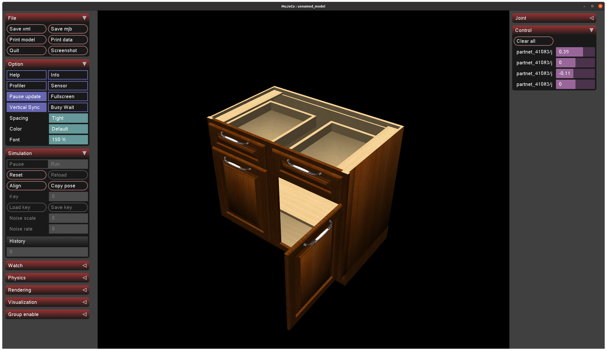

#PartNet-Mobility Datasets to MJCF format for Mujoco Simulator

# Overall
This repo contains codes to convert PartNet-Mobility Datasets which are suited for SAPIEN simulator to MJCF format. We expect this would help users to spawn the datasets in Mujoco simulator easily. 

# Dependencies
- Blender 2.79
- numpy
- scipy
- [obj2urdf](https://github.com/kevinzakka/obj2mjcf)

__NOTE__: We use [dm_control]("https://github.com/google-deepmind/dm_control") as well as mujoco to run `visu.py` for visualization, but it is not the only option. Feel free to use other options.

# Steps

## 1. Download PartNet Mobility
Download the dataset from [here](https://sapien.ucsd.edu/downloads).

## 2. obj2mesh
Run obj2mesh for the instance you want to bring up.


For all instances, just run
```
bash obj2mesh.sh
```
This command divides .obj files into the small .obj files so that each .obj files contains a single .mtl files. Since a single mesh must have a single material attribute in a mjcf file, this process is mandatory.

## 3. Utilize Blender to modify 2D meshes to 3D meshes
This step check if the output .obj meshes from __2__ in `textured_objs` from each instance folder is whether 2D or not. If it is 2D, we use Blender to give small thicknes (0.001) so that it does not raise an error.

```
blender --background --python blender.py -- --dataset_dir /path/to/pmobility/dataset --obj_idx 197 # example, -1 for all instances
```
Check `textured_objs_thickness` from each instance folder if it runs correctly.

### 4. Create mjcf file
```
python partnetmob2mjcf.py --dataset_dir /path/to/pmobility/dataset --obj_idx 197 # example, -1 for all instances --scale 0.1
```    
Check `mujoco.mjcf` from each instance folder if it runs correctly.

# Visualization

```
python visu.py /path/to/pmobility/dataset/{obj_idx}/mujoco.mjcf
```



# Citation
- SAPIEN simulator & PartNet-Mobility

    ```
    @InProceedings{Xiang_2020_SAPIEN,
    author = {Xiang, Fanbo and Qin, Yuzhe and Mo, Kaichun and Xia, Yikuan and Zhu, Hao and Liu, Fangchen and Liu, Minghua and Jiang, Hanxiao and Yuan, Yifu and Wang, He and Yi, Li and Chang, Angel X. and Guibas, Leonidas J. and Su, Hao},
    title = {{SAPIEN}: A SimulAted Part-based Interactive ENvironment},
    booktitle = {The IEEE Conference on Computer Vision and Pattern Recognition (CVPR)},
    month = {June},
    year = {2020}}
    ```

    ```
    @InProceedings{Mo_2019_CVPR,
    author = {Mo, Kaichun and Zhu, Shilin and Chang, Angel X. and Yi, Li and Tripathi, Subarna and Guibas, Leonidas J. and Su, Hao},
    title = {{PartNet}: A Large-Scale Benchmark for Fine-Grained and Hierarchical Part-Level {3D} Object Understanding},
    booktitle = {The IEEE Conference on Computer Vision and Pattern Recognition (CVPR)},
    month = {June},
    year = {2019}
    }
    ```

    ```
    @article{chang2015shapenet,
    title={Shapenet: An information-rich 3d model repository},
    author={Chang, Angel X and Funkhouser, Thomas and Guibas, Leonidas and Hanrahan, Pat and Huang, Qixing and Li, Zimo and Savarese, Silvio and Savva, Manolis and Song, Shuran and Su, Hao and others},
    journal={arXiv preprint arXiv:1512.03012},
    year={2015}
    }
    ```
- Mujoco
    ```
    @inproceedings{todorov2012mujoco,
  title={MuJoCo: A physics engine for model-based control},
  author={Todorov, Emanuel and Erez, Tom and Tassa, Yuval},
  booktitle={2012 IEEE/RSJ International Conference on Intelligent Robots and Systems},
  pages={5026--5033},
  year={2012},
  organization={IEEE},
  doi={10.1109/IROS.2012.6386109}
    }
    ```